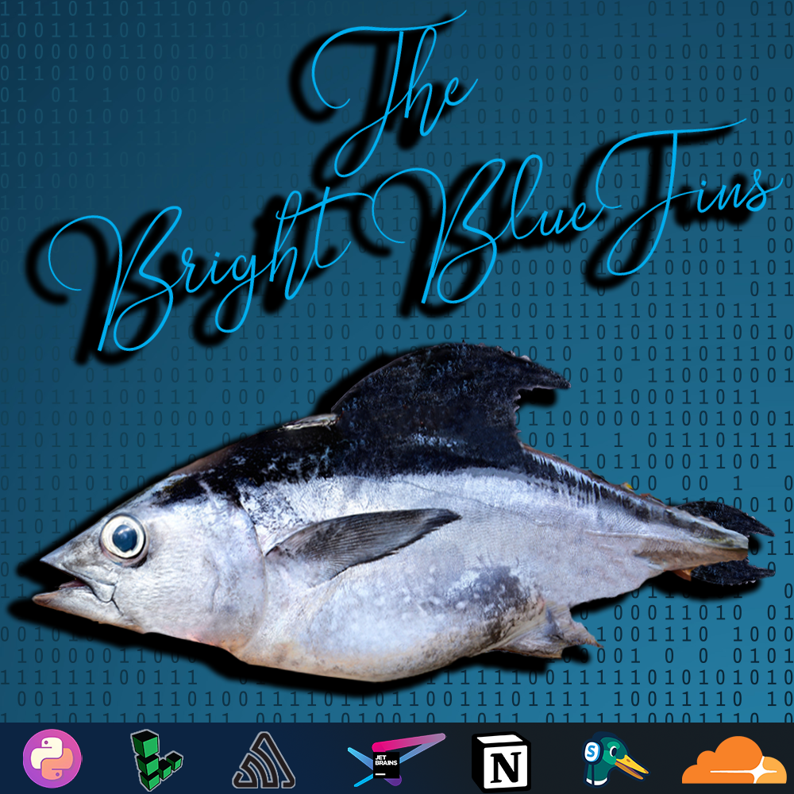

<!-- SHIELDS -->

[![Contributors][contributors-shield]][contributors-url]
[![Issues][issues-shield]][issues-url]
[![MIT License][license-shield]][license-url]
[![pre-commit][pre-commit-shield]][pre-commit-url]
![python-version-shield]

<!-- PROJECT LOGO -->
<br>
<p align="center">
  <a href="https://github.com/DavinderJolly/bright-bluefins">
    
  </a>
  <h1 align="center">BoxOS</h1>

  A simple Shell that mimics the nostalgic MS-DOS from the 1980s made by Bright Bluefins of Python Discord Summer Code Jam 2021.
  <br>
  <br>
</p>

<!-- TABLE OF CONTENTS -->

## Table of Contents

1. [About The Project](#about-the-project)
   - [How It Works](#how-it-works)
   - [Built With](#built-with)
1. [Getting Started](#getting-started)
   - [Installation on Windows](#installation-on-windows)
   - [Installation on Linux](#installation-on-linux)
1. [Usage](#usage)
1. [License](#license)
1. [Resources](#resources)

<!-- ABOUT THE PROJECT -->

## About The Project

<p align="center">
    
</p> <br>

This project aims to create a clone of a MS-DOS with python and prompt-toolkit framework. We named it ***BoxOS*** because the TUI resembles an old box inside the modern OS with GUIs. In a nutshell, it is a simple shell with common and basic commands of MS-DOS. It also features a text editor called Notepad and an image viewer called Photos.

### How It Works

The shell runs on top of a prompt_toolkit prompt session, which creates a REPL and takes the user input. It then parses the input from the user and then calls the appropriate command. It keeps track of of the current path as a Path object. So that we can resolve the relative path as well as absolute path. It also uses custom styles to create the looks of the old DOS.  

### Built With

- [prompt_toolkit](https://pypi.org/project/prompt-toolkit/)
- [Pygments](https://pypi.org/project/Pygments/)
- [Pillow](https://pypi.org/project/Pillow/)
- [pythonping](https://pypi.org/project/pythonping/)
- [pyfiglet](https://pypi.org/project/pyfiglet/)

<!-- GETTING STARTED -->

## Getting Started

To get a local copy up and running follow these simple steps.

### Installation on Windows

1. Clone the repo
   ```sh
   git clone https://github.com/DavinderJolly/bright-bluefins.git
   ```
1. Install pipenv (skip to next step if already have it installed)

   ```sh
   py -m pip install pipenv
   ```

1. Install dependencies

   ```sh
   pipenv install
   ```

1. Start the program
   ```sh
   pipenv run start
   ```

### Installation on Linux

1. Clone the repo

   ```sh
   git clone https://github.com/DavinderJolly/bright-bluefins.git
   ```

1. Install pipenv (skip to next step if already have it installed)

   ```sh
   python -m pip install pipenv # (or python3 -m)
   ```

1. Install dependencies

   ```sh
   pipenv install
   ```

1. Start the program
   ```sh
   pipenv run start
   ```
<!-- USAGE EXAMPLES -->

## Usage

Example usage of few of the common commands are given below.

[ECHO](/docs/ShellCommands.md#echo)

```sh
ECHO Message
```

[EDIT](/docs/ShellCommands.md#edit)

```sh
EDIT filename.txt
```

[IMGVIEW](/docs/ShellCommands.md#imgview)

```sh
IMGVIEW image.png
```

[TREE](/docs/ShellCommands.md#tree)

```sh
TREE Path
```

[PING](/docs/ShellCommands.md#ping)
```sh
PING IP/domain
```

_For the complete and detailed list of commands and features, please refer to the [Documentation](/docs/ShellCommands.md)_

<!-- LICENSE -->

## License

Distributed under the MIT License. See `LICENSE` for more information.

<!-- ACKNOWLEDGEMENTS -->


## Resources

A lot of free resources have been used to develop this project. A huge thanks to the creators of these resources:

- [Prompt Toolkit Docs](https://python-prompt-toolkit.readthedocs.io/en/master/)
- [Prompt Toolkit Examples](https://github.com/prompt-toolkit/python-prompt-toolkit/tree/master/examples)
- [adzierzanowski/timg](https://github.com/adzierzanowski/timg)
- [ANSI Escape Codes](https://en.m.wikipedia.org/wiki/ANSI_escape_code)
- [DOS Commands List](https://en.m.wikipedia.org/wiki/List_of_DOS_commands)

<!-- MARKDOWN LINKS & IMAGES -->

[contributors-url]: https://github.com/DavinderJolly/bright-bluefins/graphs/contributors
[contributors-shield]: https://img.shields.io/github/contributors/DavinderJolly/bright-bluefins?style=flat
[issues-url]: https://github.com/DavinderJolly/bright-bluefins/issues
[issues-shield]: https://img.shields.io/github/issues/DavinderJolly/bright-bluefins?style=flat
[license-url]: https://github.com/DavinderJolly/bright-bluefins/blob/master/LICENSE.txt
[license-shield]: https://img.shields.io/github/license/DavinderJolly/bright-bluefins?style-flat
[pre-commit-url]: https://github.com/pre-commit/pre-commit
[pre-commit-shield]: https://img.shields.io/badge/pre--commit-enabled-brightgreen?logo=pre-commit&logoColor=white
[python-version-shield]: https://img.shields.io/github/pipenv/locked/python-version/DavinderJolly/Bright-Bluefins
