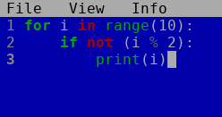
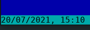
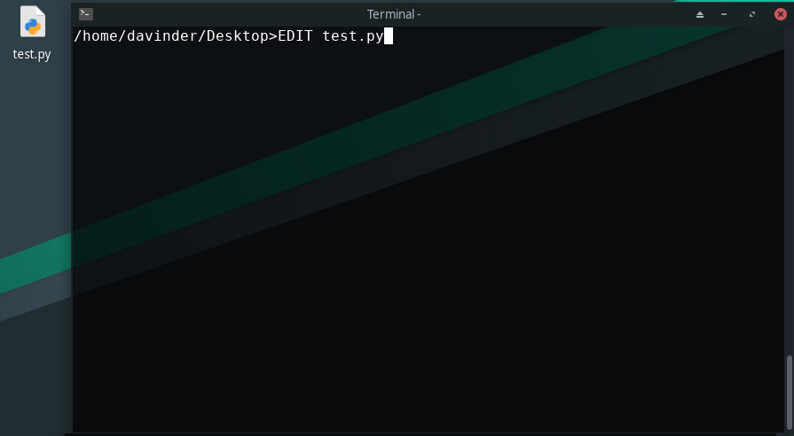
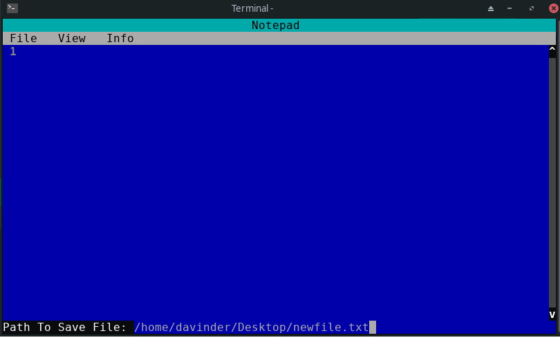
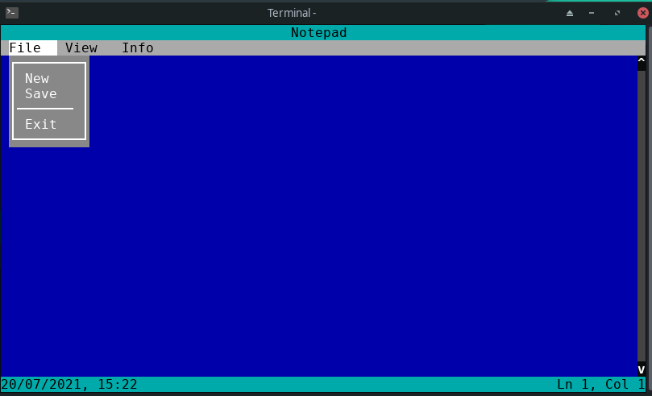
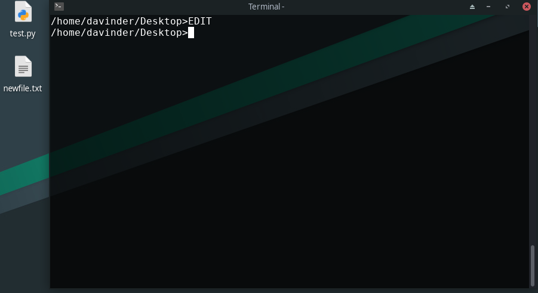

# Notepad

## Simple Text Editor with some nice features like:

- ### Line numbers
- ### Syntax Highlighting

  

- ### Date and Time display at the bottom

  

- ### Line and Column number displayed at the bottom right

  

  

## How To Use

---

- ### type `EDIT` in the Notepad followed by a filename to open a filename in the editor

  

- ### if there's no file then just tyype `EDIT` and press **CTRL + s** to save current buffer as a file

  

- ### press CTRL + c to open the Menu

  > NOTE: New and About not implemented

  

- ### press CTRL + d to exit to the shell

  
